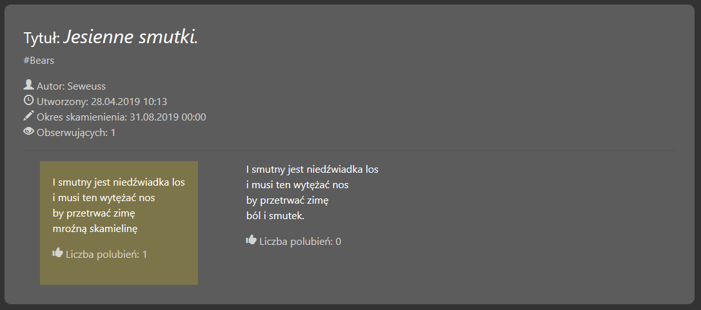
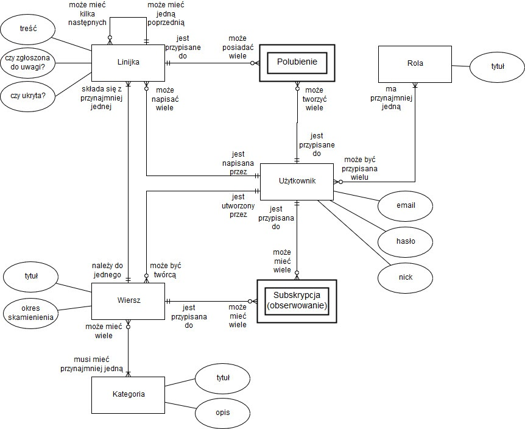
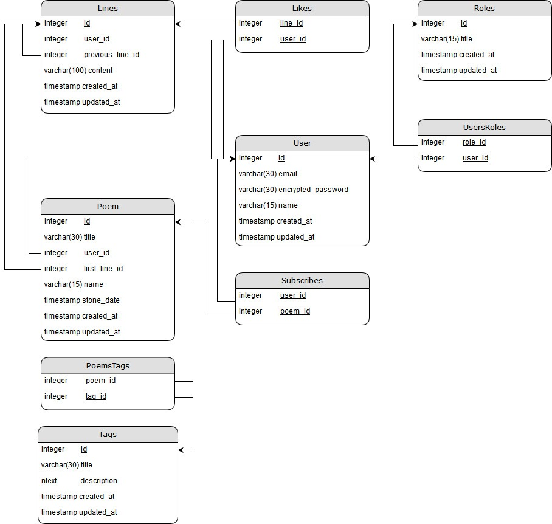
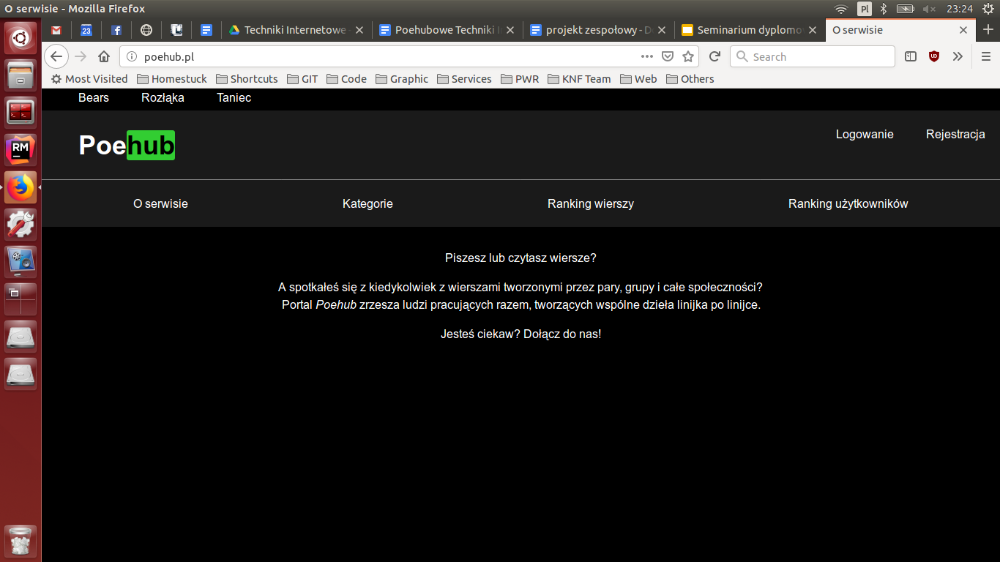
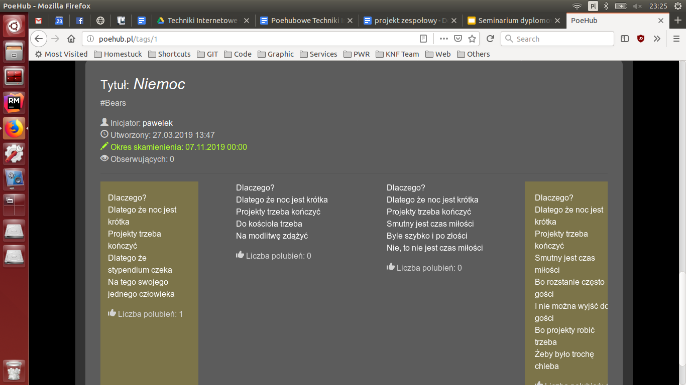
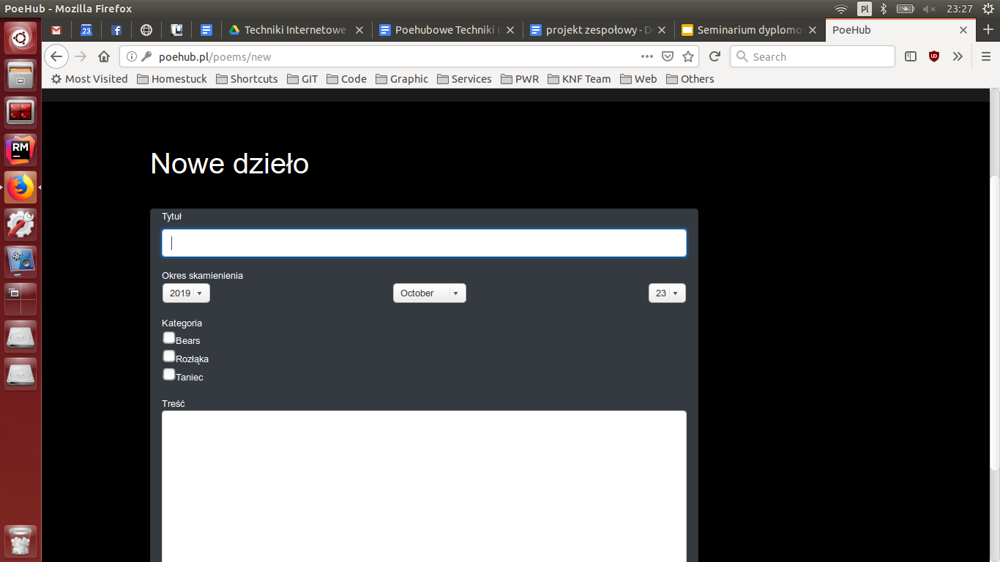
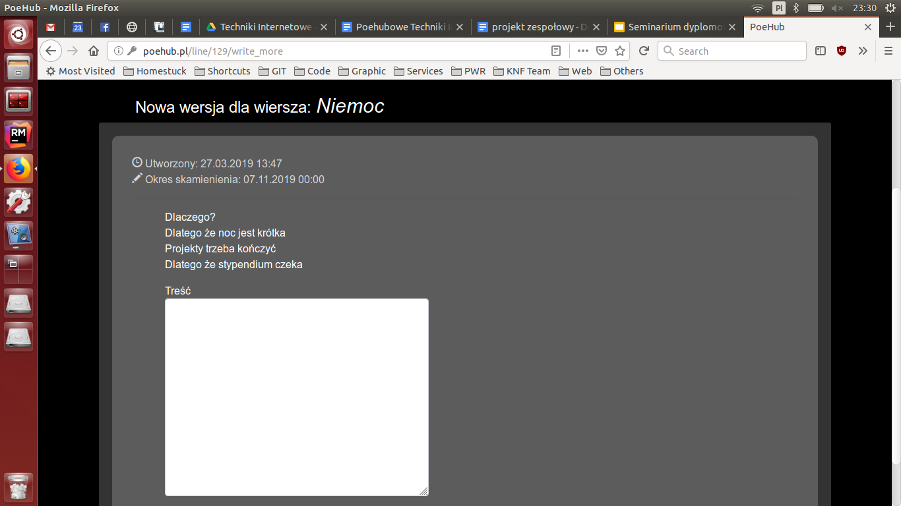

# Poehub

The application presented in the project will allow users to write poems and share their creativity with others. The user will be able to create and publish his own poems, as well as edit existing works of other website users, as well as express approval for a selected poem.

The application will allow you to add lines on a previously created user profile, thanks to which other users will be able to follow the creativity, as well as express opinions on the basis of liking the song. In addition, the web application will be able to add your own endings for any line, thanks to which a "tree" of different versions of the same poem will be created, which may become an inspiration for other users, as well as making the application more attractive and competitive. Each version can be voted on, and after a certain period of time, the official version of the poem becomes the one with the most likes.

The application will be able to act as a virtual book of poetry, created by many authors, and will also give the opportunity to conduct various types of competitions.

People undertaking group creativity will have to accept the website regulations. It will include, among others the principle that the created content can be developed by other users. Therefore, it will be possible that the final form of someone's work will differ significantly from the vision and initial idea of ​​its author.

## Table of contents
* [Poehub](#poehub)
	* [Technologies](#technologies)
	* [Setup](#setup)
	* [Usage](#usage)
* [Project](#project)
	* [Introduction](#introduction)
	* [Project assumptions](#project_assumptions)
	* [Description of the technologies used](#description-of-the-technologies-used)
	* [Presentation of the website functions](#presentation-of-the-website-functions)
	* [Access to the application](#access-to-the-application)

## Technologies
* Ruby 2.3.1
* Rails 5.1.4

## Setup
Clone this repo to your desktop. 

Configure your gemset (by creating a new gemset for this application with installed RVM - `rvm gemset create poehub`) and install gems by `bundle install`. 

Setup your Postgresql database by creating user, database and adding privileges on database to this user, then complete configuration in `config/database.yml` file. If database is ready, perform database migration by `rake db:migrate`.

## Usage

If setup is successed, you can run the application by `rails s` on your localhost and see a website at `localhost:3000`.

# Project

## Introduction

### Description of the problem

The development of technology has changed the approach of poets to their work - they need inspiration that will help them create new works. It becomes indispensable to have a tool for group creativity.

Until now, poems were written by individuals. This imposes many limitations, i.e. lack of developing the thoughts of the other person and imposed interpretation of a given piece.

### Existing attempts to solve the problem

There have been many attempts to integrate poets through various types of blogs. Such solutions, however, only allowed for commenting and evaluating someone else's work. They did not offer the possibility of sharing it with the possibility of further development.

The resulting works are no longer visited after publication and initial comments. Such works have only one character. They cannot be changed. Their development ended as soon as they were written.

Integration between individual users is limited to comments only. This does not in any way encourage your own interpretation of the written works, but only to focus on the point of view of their authors.

### Proposed solution

The proposed solution to this problem is to create a dedicated tool that will bring together the community of writers and poets. Such a system will allow you to write, publish, share and develop poetry not only of your own authorship, but also of other website users.

### Benefits of launching the website

Such a system will make it possible to reach a younger group of people and interest in their culture through the use of technology that is friendly to them. The implementation of the project will allow for the multi-generational integration of older, experienced authors and young beginners interested in poetry. The most important benefit is the presentation of a different approach to creativity, which does not have to be the work of one person, but many users, as well as the use of new technologies in the subject of poetry, instead of classic book solutions.

## Project assumptions

Website functions:
* you can become a website user by creating an account and logging in to it or viewing the content of the website as a non-logged user,
* a user with an account may have many roles that give him rights to certain activities on the website,
* logged in users can write poems,
* each poem has an initiator who gave the poem a title, category and fossil time, and wrote the first version,
* from any line, website users can write an alternative continuation by creating new versions of this line,
* new versions of the poem can be created before the fossil time given by the initiator has expired,
* users have a list of watched lines, they can add and delete lines from it,
* users have a list of watched users, they can add and remove users from it,
* users can like to any version of the poem, it is a reversible operation,
* the version of a row with the most likes is highlighted as the official version of that row,
* the created row and the version after publishing can no longer be edited or deleted,
* the moderator can take the selected role away from the user in cases that require it (e.g. in illegal situations),
* moderators have the ability to add, edit and delete categories.

### Product users
The website users are:
* Administrator
* Moderator
* Observer
* Writer
* User not logged in

Users who have an account on the website may have several roles at the same time. Below is a description of each of them:

`Administrator`: The administrator is the person responsible for the technical maintenance of the website. It has access to the server console and maintains the functionality of the website. This user does not need to have a Poehub account.

`Moderator`: Moderator is the person responsible for the content posted by users on the site. This person censors inappropriate content, controls content posted by writers, is responsible for blocking non-compliant users who post inappropriate content. It is also responsible for helping other users with technical problems. This person has a moderator's account on the Poehub website.

`Observer`: This is a person who can view other users' poems (e.g. in a given category). It has the ability to observe specific users (follow their creativity) and give likes to the versions of the poems read - thus, it influences the selection of the best version of a given poem. It is a passive role because it does not bring new content to the website. Based on the votes of the observers, the competitions organized regularly on the website are settled.

`Writer`: This is a person who writes poems, adds his own alternative continuation to other poems, and publishes them on the Poehub site. Must adapt to the prevailing regulations of the website, because it cannot publish offensive and indescribable content. Writers also appear in the writer ranking - depending on the number of poems started. This user must confirm the terms and conditions of the Poehub website.

`User not logged in`: User not logged in can view and view already published work (in a given category, as an observer), but cannot evaluate it in any way. This user does not have to confirm the website regulations, therefore he has no right to use the main functionality of the website.

### Row data in the system
In addition to the content, the system is to store data about lines such as:
* initiator
* creation time
* period of petrification - the point from which the poem cannot be further developed
* assigned category
* number of followers
* the number of likes for each version

Writers, starting from the second line, can add their own alternative continuation of the poem - different versions of the same work are created.

The poem was written by Seweuss. Its initial content was:
> I smutny jest niedźwiadka los
i musi ten wytężać nos
by przetrwać zimę
mroźną skamielinę

But another writer added an alternate continuation by creating a version:
> I smutny jest niedźwiadka los
i musi ten wytężać nos
by przetrwać zimę
ból i smutek.

The entire poem is watched by one person, the first version has one like and is currently the best version of the poem (highlighted by lighter background).

### Permissions

| Funkcja                                                | Użytkownik niezalogowany | Obserwator | Pisarz | Moderator |
|--------------------------------------------------------|--------------------------|------------|--------|-----------|
| Zakładanie konta                                       | X                        |            |        |           |
| Logowanie                                              | X                        |            |        |           |
| Wylogowanie                                            |                          | X          | X      | X         |
| Resetowanie hasła                                      |                          | X          | X      | X         |
| Edycja własnego profilu                                |                          | X          | X      | X         |
| Wyświetlanie listy kategorii                           | X                        | X          | X      | X         |
| Wyświetlanie listy ulubionych wersji wierszy           |                          | X          |        |           |
| Wyświetlanie listy obserwowanych wierszy               |                          | X          |        |           |
| Wyświetlanie listy obserwowanych użytkowników          |                          | X          |        |           |
| Wyświetlanie wierszy w danej kategorii                 | X                        | X          | X      | X         |
| Wyświetlanie listy napisanych wierszy                  |                          |            | X      |           |
| Pisanie nowych wierszy                                 |                          |            | X      |           |
| Pisanie alternatywnej kontynuacji istniejących wierszy |                          |            | X      |           |
| Obserwowanie wiersza                                   |                          | X          |        |           |
| Zaprzestanie obserwowania wiersza                      |                          | X          |        |           |
| Obserwowanie użytkownika                               |                          | X          |        |           |
| Zaprzestanie obserwowania użytkownika                  |                          | X          |        |           |
| Oddawanie głosu na wiersz                              |                          | X          |        |           |
| Cofnięcie głosu na wiersz                              |                          | X          |        |           |
| Wyświetlanie rankingu wierszy                          |                          | X          |        |           |
| Wyświetlanie rankingu użytkowników                     |                          | X          |        |           |
| Wyświetlanie wierszy danego użytkownika                |                          | X          |        | X         |
| Wyświetlanie listy użytkowników                        |                          |            |        | X         |
| Odbieranie/dawanie ról użytkownikom                    |                          |            |        | X         |
| Ukrywanie nieodpowiednich wersji wierszy               |                          |            |        | X         |
| Przywrócenie widoczności wersji wierszy                |                          |            |        | X         |
| Zgłaszanie wierszy z nieodpowiednią treścią            |                          | X          |        |           |
| Dodawanie nowej kategorii                              |                          |            |        | X         |
| Edytowanie kategorii                                   |                          |            |        | X         |
| Usuwanie kategorii                                     |                          |            |        | X         |

### Entity schema

### Database schema

### Lines relationship example

The content of the poems will consist of lines, each of them may have a different author. An important aspect of the system will be to store different versions of the same row in an optimal way, i.e. without data redundancy.

The following assumptions were made:
* each line points to its first line
* each line except the first line points to the previous line

This allows each line to have several more - this is how new versions of the line are created. In addition, each line will contain information about the author, so the system will know who the author of each version is.

As an example of the use of these relations, we present the line "To meet you" below and in the graph on the next page. The graph represents schematically what the saved row will look like in the system database.

## Description of the technologies used

### Architectural model of MVC
Due to the numerous functional requirements for individual elements, such as products, dishes, users, the MVC architectural pattern was chosen, i.e. Model-View-Controller. It consists in designing views for specific models, the information flow is controlled by controllers. Internet models will include Users and meals. Specific views will be designed for them, such as user display, user list, dish display, food list and their ingredients with all information. By using appropriate methods in the controller, these views will be able to display the data requested by the user, such as statistics or schedule.

### Ruby on Rails framework

In 2004, Ruby on Rails made its debut among the frameworks used to create web applications. Websites like 37signals, GitHub, Twitter, Groupon have started using this technology. It is 100% open source, available under the MIT license - its use is free. It combines easy-to-use Ruby language and efficiency in creating (generating) websites. The Ruby on Rails framework will be used to create this web application, due to the transparency of models and their logic and ease of implementation.

### Modular design of the application

The files of the application created in the Ruby on Rails framework are divided into modules regarding their role in the system (e.g. models, controllers, views). Creating a system involves writing the source code of the methods for the appropriate models, controllers and other previously mentioned areas. Many templates for the files mentioned above are created automatically by using commands in the console. Detailed description of the implementation of some logic and visualization will be found later in this paper.

### Use of ready-made solutions

Ruby on Rails framework provides a lot of support for developers in the form of gems. These are ready-made modules written by other programmers (e.g. companies, special groups or amateurs). Each gem has its description and documentation, thanks to which its functions can be adapted to the needs of the written system. Below is a list of gems that will be useful for the functioning of the website in question:
rails
* puma - a gem that allows the operation of the puma server, which provides the basic functionalities of the website
* ass-rails– a gem that allows you to use the Sass language, which is then compiled into CSS language used as stylesheets
* pg - a gem that allows the use of a database. Provides connection to a PostgreSQL database, performs migration, data manipulation and reading from it
* devise - a gem that creates login, registration and logout mechanisms. To the appropriate class (in this case User - User), he adds appropriate attributes in the database, provides a ready controller and views with forms for login / logout / registration operations. It also has a built-in mechanism for sending e-mails.
bootstrap and bootstrap-glyphicons - gems that allow you to use ready-made style sheets and intuitive icons.

## Presentation of the website functions

### Main page

### Poem with many versions

### Form of new poem

### Form of new version of existing poem

## Access to the application

The application runs on the server at: http://poehub.pl/. Create an account and start your art!

You can also use an example account:
* login: example@mail.com
* password: WbQ4PA3KLG9QSu7
